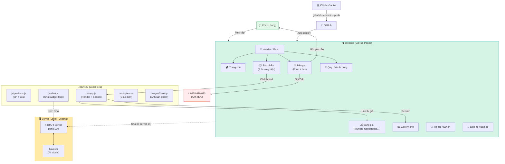

# 🗺️ Sơ đồ hoạt động Website VLHT Trần Hữu Minh

## Mô tả luồng hoạt động:

### 📌 Luồng chính (Website)
1. **Khách hàng** truy cập → Web hiện trang chủ
2. **Click menu** → Chuyển section tương ứng
3. **Click thương hiệu** → Render danh sách sản phẩm
4. **Search** → Tìm kiếm sản phẩm
5. **Báo giá** → Gửi yêu cầu / Gọi hotline

### 🛠️ Luồng cập nhật
1. Anh Hữu sửa file (products.js, index.html...)
2. `git add .` → `git commit` → `git push`
3. GitHub Auto-deploy → Web cập nhật sau 1-2 phút

### 🤖 Luồng Chat bot Mây (khi server bật)
1. Khách chat trên web → fetch API
2. Server (local) → Ollama llava:7b → Trả lời
3. Hiển thị câu trả lời lên widget

---

*Cập nhật: 03/05/2026*
